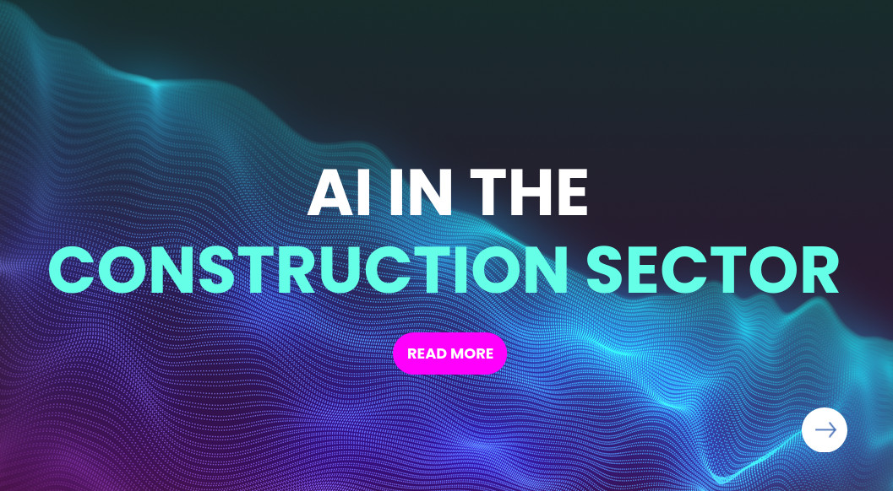

# Cloud Computing

For this class lesson we chose the following case study for its technological value and for being a clear example of the improvements that new technologies can bring in the field of infrastructure and building construction.

[An AI view of the construction site: GOLDBECK and HoloBuilder detect defects using automated documentation with Microsoft Azure](https://www.microsoft.com/en/customers/story/1422938843831293737-goldbeck-HoloBuilder-azure-machine-learning-en#project-details-section)

You can watch the visual presentation [here](https://www.canva.com/design/DAGc2rZyDbg/-pCdkbMyhJJkO15DjfP4SQ/edit).

You can visit Goldbeck site [here](https://www.goldbeck.de/).

# What is Cloud Computing?

Cloud computing refers to the delivery of computing services over the internet ("the cloud"), enabling individuals and organizations to access resources such as servers, storage, databases, networking, software, and more, on-demand. Instead of owning and maintaining physical hardware and infrastructure, users can rent resources from cloud providers, paying only for what they use.

### Advantages of Cloud Computing:

**Cost Efficiency**: Reduces capital expenses by eliminating the need to purchase and maintain hardware.

**Scalability**: Easily scales resources up or down to meet changing demands.

**Flexibility and Accessibility**: Allows users to access applications and data from anywhere with an internet connection.

**Performance and Reliability**: Provides access to high-performance computing and ensures redundancy to minimize downtime.

**Innovation**: Frees up time and resources, enabling businesses to focus on innovation rather than infrastructure management.

### Types of Cloud computing services:

**Infrastructure as a Service (IaaS)**: Offers virtualized computing resources like virtual machines and storage.

**Platform as a Service (PaaS)**: Provides platforms for developing, testing, and deploying applications.

**Software as a Service (SaaS)**: Delivers software applications over the internet, accessible via a web browser.

The actual most important providers are:

Microsoft Azure

Amazon Web Services (AWS)

Google Cloud

# Microsoft Azure

Microsoft Azure is a very complete cloud platform designed to cover a wide range of technological needs. 
It is designed for companies of all sizes, from startups to large corporations, and covers sectors such as application development, artificial intelligence, big data, internet of things (IoT), and more.

As a developer, you can use Azure to easily deploy web apps or APIs.

If you work with machine learning, you have tools to train AI models.

If you are a company that wants to migrate its servers, you can do it with Azure Migrate.

And if you're curious about new technologies like blockchain or quantum computing, Azure has specific services for that too.

Many functionalities complement each other. For example, you can use Azure IoT Hub to connect smart devices and Azure Synapse Analytics to analyze the data generated by them.

# Microsoft Azure Utilities

## 1. Computing

**Virtual Machines (VMs)**: Provides scalable virtual environments to run applications and services.

**Containers**: Offers services like Azure Kubernetes Service (AKS) to manage containers.

**Azure Functions**: Run code without managing servers, ideal for background tasks or event-driven applications.

## 2. Storage

**Blob Storage**: Scalable object storage for unstructured data like images, videos, and backups.

**File Storage**: Shared file systems accessible from virtual machines.

**Disk Storage**: High-performance storage for operating systems and applications.

## 3. Databases

**Azure SQL Database**: Managed service for SQL databases.

**Cosmos DB**: Globally distributed, multi-model NoSQL database.

**Azure Database for MySQL/PostgreSQL**: Managed relational databases with scalability and high availability.

## 4. Networking

**Virtual Networks (VNet)**: Create secure private networks.

**Azure Front Door**: Speeds up web application delivery with global load balancing and intelligent routing.

**Azure VPN Gateway**: Secure connection between on-premises networks and Azure.

## 5. Artificial Intelligence and Machine Learning

**Azure Cognitive Services**: Pre-configured APIs for adding vision, speech, language, and search capabilities.

**Azure Machine Learning**: Platform for training, deploying, and managing ML models.

## 6. Application Development

**Azure App Service**: Rapid deployment of web applications and APIs.

**DevOps**: Integration with tools like Azure DevOps for project management, CI/CD, and automated deployments.

## 7. Data Analytics

**Azure Synapse Analytics**: Integration of large volumes of data for analysis and visualization.

**Azure Data Lake**: Storage and processing for massive datasets.

**Azure Stream Analytics**: Real-time data processing.

## 8. Internet of Things (IoT)

**IoT Hub**: Secure management of connected IoT devices.

**IoT Central**: Ready-to-use platform for IoT applications.

**Digital Twins**: Digital modeling of physical environments.

## 9. Security

**Azure Active Directory**: Identity and access management.

**Azure Security Center**: Monitoring and protecting resources in the cloud and on-premises.

**Key Vault**: Secure storage for keys, passwords, and certificates.

## 10. Migration and Backup

**Azure Migrate**: Tools for migrating on-premises resources to Azure.

**Azure Backup**: Reliable solution for data backups and recovery.

## 11. Management and Monitoring

**Azure Monitor**: Real-time monitoring of resources and applications.

**Azure Cost Management**: Tools to optimize costs and manage budgets.

**Azure Policy**: Enforcement of compliance policies across resources.

## 12. Mixed Reality

**Azure Mixed Reality Services**: Support for mixed reality projects like Azure Remote Rendering and Object Anchors.

## 13. Blockchain

**Azure Blockchain Service**: Platform for creating and managing blockchain networks.

## 14. Enterprise Integration

**Logic Apps**: Workflow automation between different apps and services.

**Service Bus**: Reliable communication between applications through queues and messaging.

## 15. Quantum Computing

**Azure Quantum**: Access to quantum computing solutions.

